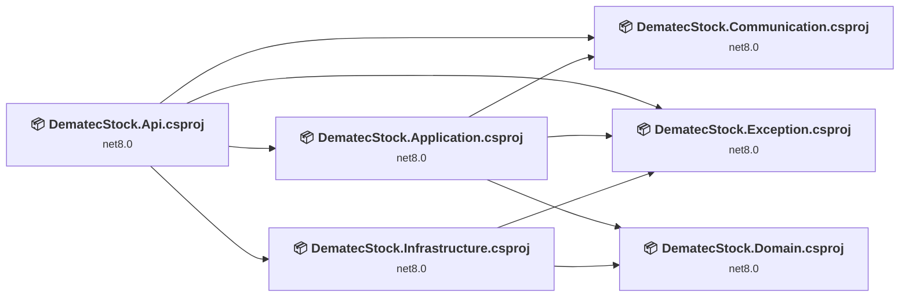
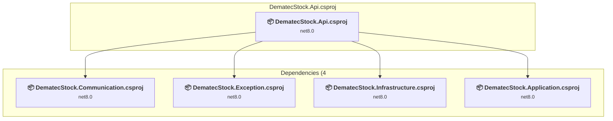
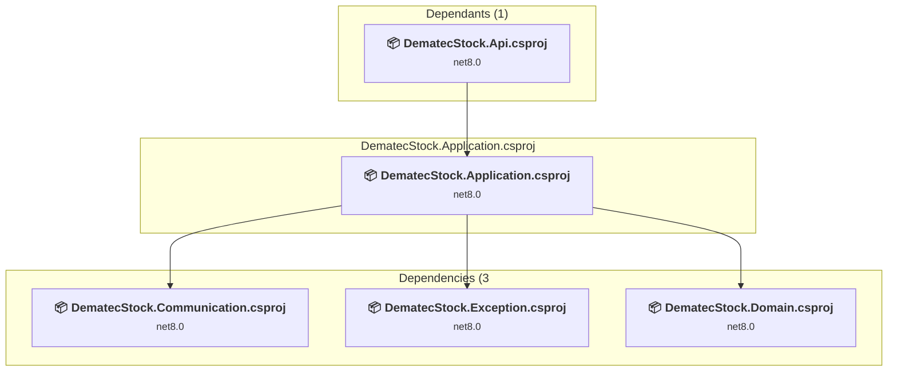
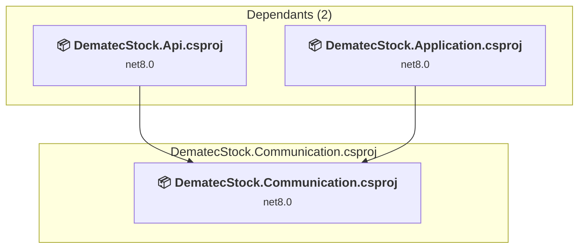
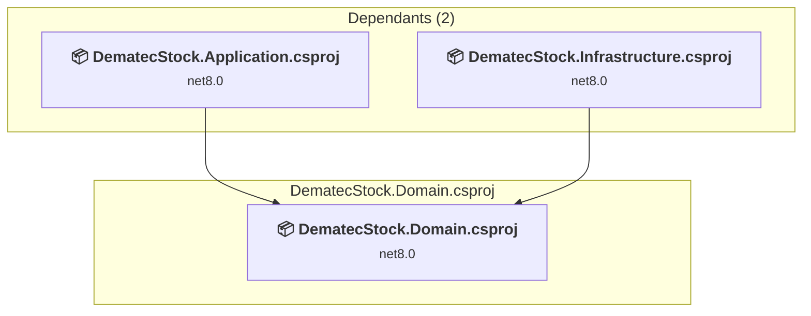
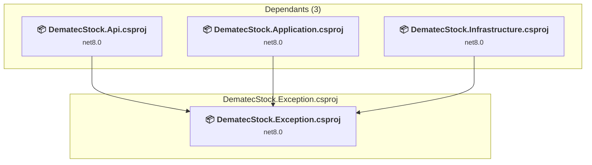
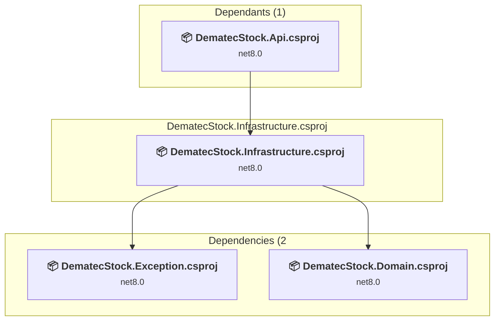

# Projects and dependencies analysis

This document provides a comprehensive overview of the projects and their dependencies in the context of upgrading to .NETCoreApp,Version=v10.0.

## Table of Contents

- [Executive Summary](#executive-Summary)
  - [Highlevel Metrics](#highlevel-metrics)
  - [Projects Compatibility](#projects-compatibility)
  - [Package Compatibility](#package-compatibility)
  - [API Compatibility](#api-compatibility)
- [Aggregate NuGet packages details](#aggregate-nuget-packages-details)
- [Top API Migration Challenges](#top-api-migration-challenges)
  - [Technologies and Features](#technologies-and-features)
  - [Most Frequent API Issues](#most-frequent-api-issues)
- [Projects Relationship Graph](#projects-relationship-graph)
- [Project Details](#project-details)

  - [src\DematecStock.Api\DematecStock.Api.csproj](#srcdematecstockapidematecstockapicsproj)
  - [src\DematecStock.Application\DematecStock.Application.csproj](#srcdematecstockapplicationdematecstockapplicationcsproj)
  - [src\DematecStock.Communication\DematecStock.Communication.csproj](#srcdematecstockcommunicationdematecstockcommunicationcsproj)
  - [src\DematecStock.Domain\DematecStock.Domain.csproj](#srcdematecstockdomaindematecstockdomaincsproj)
  - [src\DematecStock.Exception\DematecStock.Exception.csproj](#srcdematecstockexceptiondematecstockexceptioncsproj)
  - [src\DematecStock.Infrastructure\DematecStock.Infrastructure.csproj](#srcdematecstockinfrastructuredematecstockinfrastructurecsproj)

## Executive Summary

### Highlevel Metrics

| Metric | Count | Status |
| :--- | :---: | :--- |
| Total Projects | 6 | All require upgrade |
| Total NuGet Packages | 10 | 5 need upgrade |
| Total Code Files | 60 |  |
| Total Code Files with Incidents | 10 |  |
| Total Lines of Code | 1651 |  |
| Total Number of Issues | 26 |  |
| Estimated LOC to modify | 15+ | at least 0,9% of codebase |

### Projects Compatibility

| Project | Target Framework | Difficulty | Package Issues | API Issues | Est. LOC Impact | Description |
| :--- | :---: | :---: | :---: | :---: | :---: | :--- |
| [src\DematecStock.Api\DematecStock.Api.csproj](#srcdematecstockapidematecstockapicsproj) | net8.0 | 🟢 Low | 1 | 8 | 8+ | AspNetCore, Sdk Style = True |
| [src\DematecStock.Application\DematecStock.Application.csproj](#srcdematecstockapplicationdematecstockapplicationcsproj) | net8.0 | 🟢 Low | 1 | 1 | 1+ | ClassLibrary, Sdk Style = True |
| [src\DematecStock.Communication\DematecStock.Communication.csproj](#srcdematecstockcommunicationdematecstockcommunicationcsproj) | net8.0 | 🟢 Low | 0 | 0 |  | ClassLibrary, Sdk Style = True |
| [src\DematecStock.Domain\DematecStock.Domain.csproj](#srcdematecstockdomaindematecstockdomaincsproj) | net8.0 | 🟢 Low | 0 | 0 |  | ClassLibrary, Sdk Style = True |
| [src\DematecStock.Exception\DematecStock.Exception.csproj](#srcdematecstockexceptiondematecstockexceptioncsproj) | net8.0 | 🟢 Low | 0 | 0 |  | ClassLibrary, Sdk Style = True |
| [src\DematecStock.Infrastructure\DematecStock.Infrastructure.csproj](#srcdematecstockinfrastructuredematecstockinfrastructurecsproj) | net8.0 | 🟢 Low | 3 | 6 | 6+ | ClassLibrary, Sdk Style = True |

### Package Compatibility

| Status | Count | Percentage |
| :--- | :---: | :---: |
| ✅ Compatible | 5 | 50,0% |
| ⚠️ Incompatible | 0 | 0,0% |
| 🔄 Upgrade Recommended | 5 | 50,0% |
| ***Total NuGet Packages*** | ***10*** | ***100%*** |

### API Compatibility

| Category | Count | Impact |
| :--- | :---: | :--- |
| 🔴 Binary Incompatible | 8 | High - Require code changes |
| 🟡 Source Incompatible | 7 | Medium - Needs re-compilation and potential conflicting API error fixing |
| 🔵 Behavioral change | 0 | Low - Behavioral changes that may require testing at runtime |
| ✅ Compatible | 2024 |  |
| ***Total APIs Analyzed*** | ***2039*** |  |

## Aggregate NuGet packages details

| Package | Current Version | Suggested Version | Projects | Description |
| :--- | :---: | :---: | :--- | :--- |
| AutoMapper | 14.0.0 |  | [DematecStock.Application.csproj](#srcdematecstockapplicationdematecstockapplicationcsproj) | ✅Compatible |
| BCrypt.Net-Next | 4.0.3 |  | [DematecStock.Infrastructure.csproj](#srcdematecstockinfrastructuredematecstockinfrastructurecsproj) | ✅Compatible |
| DocumentFormat.OpenXml | 3.4.1 |  | [DematecStock.Domain.csproj](#srcdematecstockdomaindematecstockdomaincsproj) | ✅Compatible |
| Microsoft.AspNetCore.Authentication.JwtBearer | 8.0.22 | 10.0.4 | [DematecStock.Api.csproj](#srcdematecstockapidematecstockapicsproj) | Recomenda-se a atualização do pacote NuGet |
| Microsoft.EntityFrameworkCore | 9.0.11 | 10.0.4 | [DematecStock.Infrastructure.csproj](#srcdematecstockinfrastructuredematecstockinfrastructurecsproj) | Recomenda-se a atualização do pacote NuGet |
| Microsoft.EntityFrameworkCore.SqlServer | 9.0.11 | 10.0.4 | [DematecStock.Infrastructure.csproj](#srcdematecstockinfrastructuredematecstockinfrastructurecsproj) | Recomenda-se a atualização do pacote NuGet |
| Microsoft.Extensions.Configuration.Binder | 10.0.1 | 10.0.4 | [DematecStock.Infrastructure.csproj](#srcdematecstockinfrastructuredematecstockinfrastructurecsproj) | Recomenda-se a atualização do pacote NuGet |
| Microsoft.Extensions.DependencyInjection | 9.0.11 | 10.0.4 | [DematecStock.Application.csproj](#srcdematecstockapplicationdematecstockapplicationcsproj) | Recomenda-se a atualização do pacote NuGet |
| Swashbuckle.AspNetCore | 6.6.2 |  | [DematecStock.Api.csproj](#srcdematecstockapidematecstockapicsproj) | ✅Compatible |
| System.IdentityModel.Tokens.Jwt | 8.15.0 |  | [DematecStock.Infrastructure.csproj](#srcdematecstockinfrastructuredematecstockinfrastructurecsproj) | ✅Compatible |

## Top API Migration Challenges

### Technologies and Features

| Technology | Issues | Percentage | Migration Path |
| :--- | :---: | :---: | :--- |
| IdentityModel & Claims-based Security | 4 | 26,7% | Windows Identity Foundation (WIF), SAML, and claims-based authentication APIs that have been replaced by modern identity libraries. WIF was the original identity framework for .NET Framework. Migrate to Microsoft.IdentityModel.* packages (modern identity stack). |

### Most Frequent API Issues

| API | Count | Percentage | Category |
| :--- | :---: | :---: | :--- |
| M:Microsoft.Extensions.Configuration.ConfigurationBinder.GetValue''1(Microsoft.Extensions.Configuration.IConfiguration,System.String) | 3 | 20,0% | Binary Incompatible |
| T:Microsoft.AspNetCore.Authentication.JwtBearer.JwtBearerDefaults | 2 | 13,3% | Source Incompatible |
| F:Microsoft.AspNetCore.Authentication.JwtBearer.JwtBearerDefaults.AuthenticationScheme | 2 | 13,3% | Source Incompatible |
| P:Microsoft.AspNetCore.Authentication.JwtBearer.JwtBearerOptions.TokenValidationParameters | 1 | 6,7% | Source Incompatible |
| T:Microsoft.Extensions.DependencyInjection.JwtBearerExtensions | 1 | 6,7% | Source Incompatible |
| M:Microsoft.Extensions.DependencyInjection.JwtBearerExtensions.AddJwtBearer(Microsoft.AspNetCore.Authentication.AuthenticationBuilder,System.Action{Microsoft.AspNetCore.Authentication.JwtBearer.JwtBearerOptions}) | 1 | 6,7% | Source Incompatible |
| T:Microsoft.Extensions.DependencyInjection.ServiceCollectionExtensions | 1 | 6,7% | Binary Incompatible |
| M:System.IdentityModel.Tokens.Jwt.JwtSecurityTokenHandler.WriteToken(Microsoft.IdentityModel.Tokens.SecurityToken) | 1 | 6,7% | Binary Incompatible |
| M:System.IdentityModel.Tokens.Jwt.JwtSecurityTokenHandler.CreateToken(Microsoft.IdentityModel.Tokens.SecurityTokenDescriptor) | 1 | 6,7% | Binary Incompatible |
| T:System.IdentityModel.Tokens.Jwt.JwtSecurityTokenHandler | 1 | 6,7% | Binary Incompatible |
| M:System.IdentityModel.Tokens.Jwt.JwtSecurityTokenHandler.#ctor | 1 | 6,7% | Binary Incompatible |

## Projects Relationship Graph

Legend:
📦 SDK-style project
⚙️ Classic project

## Project Details

### src\DematecStock.Api\DematecStock.Api.csproj

#### Project Info

- **Current Target Framework:** net8.0
- **Proposed Target Framework:** net10.0
- **SDK-style**: True
- **Project Kind:** AspNetCore
- **Dependencies**: 4
- **Dependants**: 0
- **Number of Files**: 7
- **Number of Files with Incidents**: 2
- **Lines of Code**: 247
- **Estimated LOC to modify**: 8+ (at least 3,2% of the project)

#### Dependency Graph

Legend:
📦 SDK-style project
⚙️ Classic project

### API Compatibility

| Category | Count | Impact |
| :--- | :---: | :--- |
| 🔴 Binary Incompatible | 1 | High - Require code changes |
| 🟡 Source Incompatible | 7 | Medium - Needs re-compilation and potential conflicting API error fixing |
| 🔵 Behavioral change | 0 | Low - Behavioral changes that may require testing at runtime |
| ✅ Compatible | 323 |  |
| ***Total APIs Analyzed*** | ***331*** |  |

### src\DematecStock.Application\DematecStock.Application.csproj

#### Project Info

- **Current Target Framework:** net8.0
- **Proposed Target Framework:** net10.0
- **SDK-style**: True
- **Project Kind:** ClassLibrary
- **Dependencies**: 3
- **Dependants**: 1
- **Number of Files**: 16
- **Number of Files with Incidents**: 2
- **Lines of Code**: 386
- **Estimated LOC to modify**: 1+ (at least 0,3% of the project)

#### Dependency Graph

Legend:
📦 SDK-style project
⚙️ Classic project

### API Compatibility

| Category | Count | Impact |
| :--- | :---: | :--- |
| 🔴 Binary Incompatible | 1 | High - Require code changes |
| 🟡 Source Incompatible | 0 | Medium - Needs re-compilation and potential conflicting API error fixing |
| 🔵 Behavioral change | 0 | Low - Behavioral changes that may require testing at runtime |
| ✅ Compatible | 205 |  |
| ***Total APIs Analyzed*** | ***206*** |  |

### src\DematecStock.Communication\DematecStock.Communication.csproj

#### Project Info

- **Current Target Framework:** net8.0
- **Proposed Target Framework:** net10.0
- **SDK-style**: True
- **Project Kind:** ClassLibrary
- **Dependencies**: 0
- **Dependants**: 2
- **Number of Files**: 11
- **Number of Files with Incidents**: 1
- **Lines of Code**: 189
- **Estimated LOC to modify**: 0+ (at least 0,0% of the project)

#### Dependency Graph

Legend:
📦 SDK-style project
⚙️ Classic project

### API Compatibility

| Category | Count | Impact |
| :--- | :---: | :--- |
| 🔴 Binary Incompatible | 0 | High - Require code changes |
| 🟡 Source Incompatible | 0 | Medium - Needs re-compilation and potential conflicting API error fixing |
| 🔵 Behavioral change | 0 | Low - Behavioral changes that may require testing at runtime |
| ✅ Compatible | 412 |  |
| ***Total APIs Analyzed*** | ***412*** |  |

### src\DematecStock.Domain\DematecStock.Domain.csproj

#### Project Info

- **Current Target Framework:** net8.0
- **Proposed Target Framework:** net10.0
- **SDK-style**: True
- **Project Kind:** ClassLibrary
- **Dependencies**: 0
- **Dependants**: 2
- **Number of Files**: 16
- **Number of Files with Incidents**: 1
- **Lines of Code**: 309
- **Estimated LOC to modify**: 0+ (at least 0,0% of the project)

#### Dependency Graph

Legend:
📦 SDK-style project
⚙️ Classic project

### API Compatibility

| Category | Count | Impact |
| :--- | :---: | :--- |
| 🔴 Binary Incompatible | 0 | High - Require code changes |
| 🟡 Source Incompatible | 0 | Medium - Needs re-compilation and potential conflicting API error fixing |
| 🔵 Behavioral change | 0 | Low - Behavioral changes that may require testing at runtime |
| ✅ Compatible | 570 |  |
| ***Total APIs Analyzed*** | ***570*** |  |

### src\DematecStock.Exception\DematecStock.Exception.csproj

#### Project Info

- **Current Target Framework:** net8.0
- **Proposed Target Framework:** net10.0
- **SDK-style**: True
- **Project Kind:** ClassLibrary
- **Dependencies**: 0
- **Dependants**: 3
- **Number of Files**: 4
- **Number of Files with Incidents**: 1
- **Lines of Code**: 72
- **Estimated LOC to modify**: 0+ (at least 0,0% of the project)

#### Dependency Graph

Legend:
📦 SDK-style project
⚙️ Classic project

### API Compatibility

| Category | Count | Impact |
| :--- | :---: | :--- |
| 🔴 Binary Incompatible | 0 | High - Require code changes |
| 🟡 Source Incompatible | 0 | Medium - Needs re-compilation and potential conflicting API error fixing |
| 🔵 Behavioral change | 0 | Low - Behavioral changes that may require testing at runtime |
| ✅ Compatible | 55 |  |
| ***Total APIs Analyzed*** | ***55*** |  |

### src\DematecStock.Infrastructure\DematecStock.Infrastructure.csproj

#### Project Info

- **Current Target Framework:** net8.0
- **Proposed Target Framework:** net10.0
- **SDK-style**: True
- **Project Kind:** ClassLibrary
- **Dependencies**: 2
- **Dependants**: 1
- **Number of Files**: 8
- **Number of Files with Incidents**: 3
- **Lines of Code**: 448
- **Estimated LOC to modify**: 6+ (at least 1,3% of the project)

#### Dependency Graph

Legend:
📦 SDK-style project
⚙️ Classic project

### API Compatibility

| Category | Count | Impact |
| :--- | :---: | :--- |
| 🔴 Binary Incompatible | 6 | High - Require code changes |
| 🟡 Source Incompatible | 0 | Medium - Needs re-compilation and potential conflicting API error fixing |
| 🔵 Behavioral change | 0 | Low - Behavioral changes that may require testing at runtime |
| ✅ Compatible | 459 |  |
| ***Total APIs Analyzed*** | ***465*** |  |

#### Project Technologies and Features

| Technology | Issues | Percentage | Migration Path |
| :--- | :---: | :---: | :--- |
| IdentityModel & Claims-based Security | 4 | 66,7% | Windows Identity Foundation (WIF), SAML, and claims-based authentication APIs that have been replaced by modern identity libraries. WIF was the original identity framework for .NET Framework. Migrate to Microsoft.IdentityModel.* packages (modern identity stack). |

