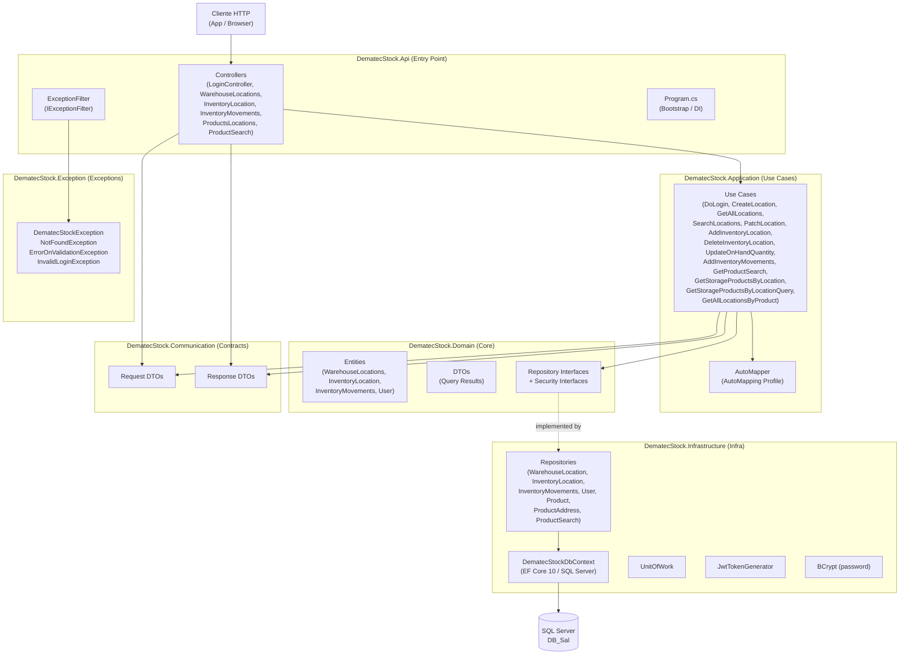
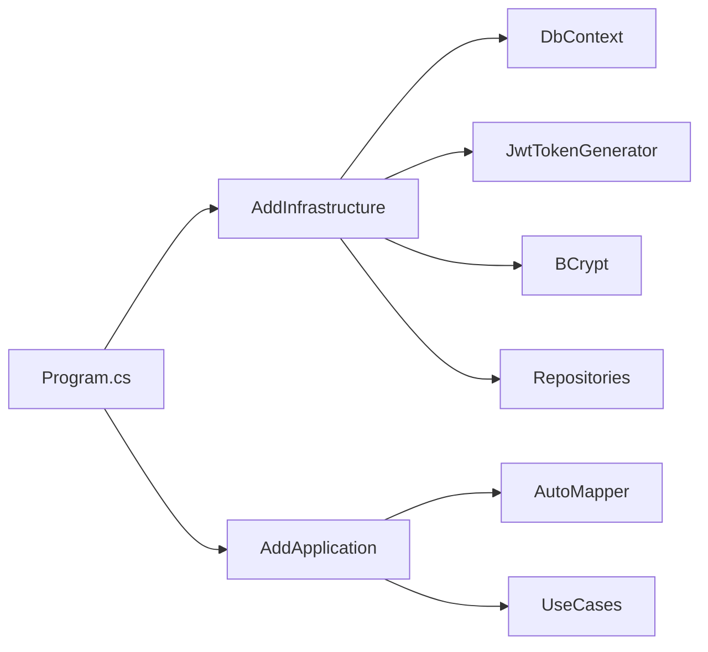
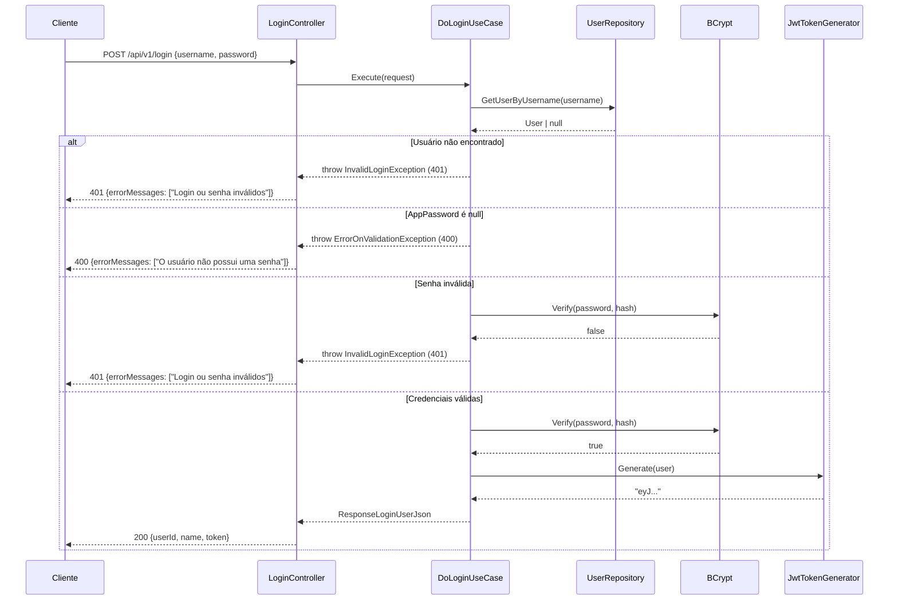
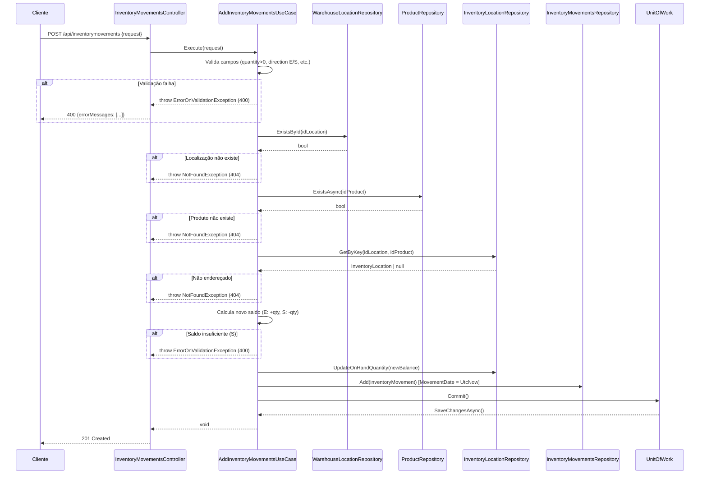
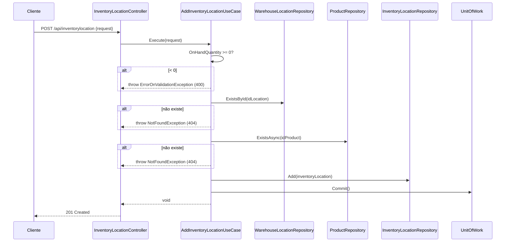

# Documentação Completa — DematecStock API

> **Gerado por:** GitHub — Análise estática completa do repositório  
> **Data de geração:** 2026  
> **Versão do SDK:** .NET 10.0.200 (global.json)  
> **Framework:** ASP.NET Core 10  

---

## Índice

1. [Visão Geral](#1-visão-geral)
2. [Arquitetura (Mermaid)](#2-arquitetura-mermaid)
3. [Estrutura do Repositório (Inventário)](#3-estrutura-do-repositório-inventário)
4. [Como Executar (Local / Dev / Prod)](#4-como-executar-local--dev--prod)
5. [Configuração — appsettings + env vars](#5-configuração--appsettings--env-vars)
6. [Pipeline HTTP — Middlewares / Filters](#6-pipeline-http--middlewares--filters)
7. [Autenticação & Autorização](#7-autenticação--autorização)
8. [Endpoints (por recurso + exemplos)](#8-endpoints-por-recurso--exemplos)
9. [Background Services / Jobs / Tasks](#9-background-services--jobs--tasks)
10. [Dados: Entities, DbContext, Migrations](#10-dados-entities-dbcontext-migrations)
11. [Fluxos Críticos (Mermaid)](#11-fluxos-críticos-mermaid)
12. [Erros & Exceptions](#12-erros--exceptions)
13. [Observabilidade (logs / metrics / tracing / health)](#13-observabilidade-logs--metrics--tracing--health)
14. [Segurança](#14-segurança)
15. [Testes (como rodar, gaps)](#15-testes-como-rodar-gaps)
16. [Checklist de Arquivos (100% coberto)](#16-checklist-de-arquivos-100-coberto)
17. [Melhorias Recomendadas](#17-melhorias-recomendadas)

---

## 1. Visão Geral

**DematecStock** é uma API REST de gestão de estoque (WMS — Warehouse Management System) desenvolvida em ASP.NET Core 10, com arquitetura Clean Architecture em camadas. Ela gerencia:

- Localizações de armazém (`Estocagem`)
- Endereçamento de produtos por localização (`ProdEstocagem`)
- Movimentações de estoque (`wmsInventoryMovement`)
- Busca de produtos via stored procedure
- Autenticação de usuários com JWT + BCrypt

O banco de dados é **SQL Server** (conexão legada, provavelmente um ERP existente — tabelas como `Produtos`, `Usuarios`, `Estocagem` indicam sistema pré-existente). A API serve como camada de acesso WMS sobre esse banco.

---

## 2. Arquitetura (Mermaid)

### 2.1 Diagrama de Camadas



### 2.2 Fluxo de Dependency Injection



---

## 3. Estrutura do Repositório (Inventário)

```
DematecStock/
├── global.json                          # SDK .NET 10.0.200
├── DematecStock.sln
├── docs/
│   └── DOCUMENTACAO_COMPLETA_API_DOTNET.md   ← este arquivo
├── src/
│   ├── DematecStock.Api/                # [ENTRY POINT] ASP.NET Core Web API
│   │   ├── Program.cs
│   │   ├── appsettings.json
│   │   ├── appsettings.Development.json   ⚠️ SEGREDOS EXPOSTOS
│   │   ├── Properties/launchSettings.json
│   │   ├── Controllers/
│   │   │   ├── LoginController.cs
│   │   │   ├── WarehouseLocationsController.cs
│   │   │   ├── InventoryLocationController.cs
│   │   │   ├── InventoryMovementsController.cs
│   │   │   ├── ProductsLocationsController.cs
│   │   │   └── ProductSearchController.cs
│   │   └── Filters/
│   │       └── ExceptionFilter.cs
│   │
│   ├── DematecStock.Application/        # [USE CASES / APPLICATION LAYER]
│   │   ├── DependencyInjectionExtension.cs
│   │   ├── AutoMapper/
│   │   │   └── AutoMapping.cs
│   │   └── UseCases/
│   │       ├── Login/DoLogin/
│   │       │   ├── DoLoginUseCase.cs
│   │       │   └── IDoLoginUseCase.cs
│   │       ├── WarehouseLocations/
│   │       │   ├── CreateLocation/
│   │       │   │   ├── CreateLocationUseCase.cs
│   │       │   │   └── ICreateLocationUseCase.cs
│   │       │   ├── GetAllLocations/
│   │       │   │   ├── GetAllLocationsUseCase.cs
│   │       │   │   └── IGetAllLocationsUseCase.cs
│   │       │   ├── PatchLocation/
│   │       │   │   ├── PatchWarehouseLocationUseCase.cs
│   │       │   │   ├── IPatchWarehouseLocationUseCase.cs
│   │       │   │   └── PatchWarehouseLocationInput.cs
│   │       │   ├── SearchLocationsByName/
│   │       │   │   ├── SearchLocationsByNameUseCase.cs
│   │       │   │   └── ISearchLocationsByNameUseCase.cs
│   │       │   └── UpdateLocation/
│   │       │       └── IUpdateWarehouseLocationUseCase.cs   ← SEM IMPLEMENTAÇÃO
│   │       ├── InventoryLocation/
│   │       │   ├── AddInventoryLocation/
│   │       │   │   ├── AddInventoryLocationUseCase.cs
│   │       │   │   └── IAddInventoryLocationUseCase.cs
│   │       │   ├── DeleteInventoryLocation/
│   │       │   │   ├── DeleteInventoryLocationUseCase.cs
│   │       │   │   └── IDeleteInventoryLocationUseCase.cs
│   │       │   └── UpdateOnHandQuantity/
│   │       │       ├── UpdateOnHandQuantityUseCase.cs
│   │       │       └── IUpdateOnHandQuantityUseCase.cs
│   │       ├── InventoryMovement/
│   │       │   ├── AddInventoryMovementsUseCase.cs
│   │       │   └── IAddInventoryMovementsUseCase.cs
│   │       ├── ProductSearch/GetProductSearch/
│   │       │   ├── GetProductSearchUseCase.cs
│   │       │   └── IGetProductSearchUseCase.cs
│   │       └── ProductsAddress/
│   │           ├── GetAllLocationsByProducts/
│   │           │   ├── GetAllLocationsByProductUseCase.cs
│   │           │   └── IGetAllLocationsByProductUseCase.cs  (GetAllStorageLocationsByProduct)
│   │           ├── GetAllStorageProductsByLocation/
│   │           │   ├── GetAllStorageProductsByLocationUseCase.cs
│   │           │   └── IGetAllStorageProductsByLocationUseCase.cs
│   │           ├── GetAllStorageLocationsByProduct/
│   │           │   └── IGetAllLocationsByProductUseCase.cs  ← duplicata/legado
│   │           └── GetStorageProductsByLocationQuery/
│   │               ├── GetStorageProductsByLocationQueryUseCase.cs
│   │               └── IGetStorageProductsByLocationQueryUseCase.cs
│   │
│   ├── DematecStock.Communication/      # [DTOs DE CONTRATO — Request/Response]
│   │   ├── Requests/
│   │   │   ├── RequestLoginJson.cs
│   │   │   ├── RequestUpdatePasswordJson.cs   ← SEM USO (dead code)
│   │   │   ├── InventoryLocation/
│   │   │   │   ├── RequestAddInventoryLocationJson.cs
│   │   │   │   └── RequestUpdateOnHandQuantityJson.cs
│   │   │   ├── InventoryMovements/
│   │   │   │   └── RequestAddInventoryMovementJsons.cs
│   │   │   └── WarehouseLocations/
│   │   │       ├── RequestWriteWarehouseLocationJson.cs
│   │   │       └── RequestUpdateWharehouseLocationJson.cs  ← nome com typo
│   │   └── Responses/
│   │       ├── ResponseErrorJson.cs
│   │       ├── ResponseLoginUserJson.cs
│   │       ├── ResponseLocationsJson.cs
│   │       ├── ResponseLocationProduct.cs
│   │       ├── ResponseLocationWithProductsJson.cs
│   │       ├── ResponseProductLocations.cs
│   │       ├── ResponseProductWithLocations.cs
│   │       ├── ResponseProductSearchPagedJson.cs
│   │       └── ResponseProductSearchItemJson.cs
│   │
│   ├── DematecStock.Domain/             # [DOMAIN — Entities, Interfaces, DTOs internos]
│   │   ├── Entities/
│   │   │   ├── WarehouseLocations.cs
│   │   │   ├── InventoryLocation.cs
│   │   │   ├── InventoryMovements.cs
│   │   │   └── User.cs
│   │   ├── DTOs/
│   │   │   ├── FlatLocationWithProductsQueryResult.cs
│   │   │   ├── LocationQueryResult.cs
│   │   │   ├── LocationWithProductsQueryResult.cs
│   │   │   ├── ProductLocationsQueryResult.cs
│   │   │   ├── ProductWithLocationsQueryResult.cs
│   │   │   └── ProductSearchQueryResult.cs
│   │   ├── Repositories/
│   │   │   ├── IUnitOfWork.cs
│   │   │   ├── InventoryLocation/
│   │   │   │   ├── IInventoryLocationWriteOnlyRepository.cs
│   │   │   │   └── IInventoryLocationUpdateOnlyRepository.cs
│   │   │   ├── InventoryMovements/
│   │   │   │   └── IInventoryMovementsWriteOnlyRepository.cs
│   │   │   ├── PorductSearch/                    ← typo no nome da pasta
│   │   │   │   └── IProductSearchReadOnlyRepository.cs
│   │   │   ├── Product/
│   │   │   │   └── IProductReadOnlyRepository.cs
│   │   │   ├── ProductAddress/
│   │   │   │   └── IProductAddressReadOnlyRepository.cs
│   │   │   ├── Users/
│   │   │   │   ├── IUserReadOnlyRepository.cs
│   │   │   │   └── IUserUpdateOnlyRepository.cs
│   │   │   └── WarehouseLocations/
│   │   │       ├── IWarehouseLocationsReadOnlyRepository.cs
│   │   │       ├── IWarehouseLocationsWriteOnlyRepository.cs
│   │   │       └── IPatchWarehouseLocationRepository.cs
│   │   └── Security/
│   │       ├── Cryptography/IPasswordEncripter.cs
│   │       └── Tokens/IAccessTokenGenerator.cs
│   │
│   ├── DematecStock.Exception/          # [EXCEÇÕES DE DOMÍNIO]
│   │   └── ExceptionsBase/
│   │       ├── DematecStockException.cs
│   │       ├── ErrorOnValidationException.cs
│   │       ├── InvalidLoginException.cs
│   │       └── NotFoundException.cs
│   │
│   └── DematecStock.Infrastructure/    # [INFRA — EF Core, JWT, BCrypt, Repositórios]
│       ├── DependencyInjectionExtension.cs
│       ├── DataAccess/
│       │   ├── DematecStockDbContext.cs
│       │   └── UnitOfWork.cs
│       ├── Repositories/
│       │   ├── WarehouseLocationRepository.cs
│       │   ├── InventoryLocationRepository.cs
│       │   ├── InventoryMovementsRepository.cs
│       │   ├── UserRepository.cs
│       │   ├── ProductRepository.cs
│       │   ├── ProductAddressRepository.cs
│       │   └── ProductSearchRepository.cs
│       └── Security/
│           ├── Cryptography/BCrypt.cs
│           └── Tokens/JwtTokenGenerator.cs
│
└── tests/
    ├── DematecStock.Tests/              # Testes unitários (Use Cases)
    │   ├── MapperFactory.cs
    │   ├── ExceptionTests.cs
    │   ├── UseCases/
    │   │   ├── Login/DoLoginUseCaseTests.cs
    │   │   ├── InventoryLocation/
    │   │   │   ├── AddInventoryLocationUseCaseTests.cs
    │   │   │   ├── DeleteInventoryLocationUseCaseTests.cs
    │   │   │   └── UpdateOnHandQuantityUseCaseTests.cs
    │   │   ├── InventoryMovement/AddInventoryMovementsUseCaseTests.cs
    │   │   ├── ProductsAddress/
    │   │   │   ├── GetAllLocationsByProductUseCaseTests.cs
    │   │   │   └── GetAllStorageProductsByLocationUseCaseTests.cs
    │   │   ├── ProductSearch/GetProductSearchUseCaseTests.cs
    │   │   └── WarehouseLocations/
    │   │       ├── CreateLocationUseCaseTests.cs
    │   │       ├── GetAllLocationsUseCaseTests.cs
    │   │       └── PatchWarehouseLocationUseCaseTests.cs
    │   └── Controllers/
    │       ├── InventoryMovementsControllerTests.cs
    │       ├── ProductSearchControllerTests.cs
    │       └── ProductsLocationsControllerTests.cs
    └── DematecStock.Api.Tests/          # Testes de integração / Controller
        ├── GlobalUsings.cs
        ├── Controllers/
        │   ├── LoginControllerTests.cs
        │   ├── ProductsLocationsControllerTests.cs
        │   └── WarehouseLocationsControllerTests.cs
        └── Filters/
            └── ExceptionFilterTests.cs
```

### 3.1 Classificação por Tipo

| Categoria | Arquivos |
|-----------|----------|
| **Entry Point** | `Program.cs` |
| **Controllers** | `LoginController`, `WarehouseLocationsController`, `InventoryLocationController`, `InventoryMovementsController`, `ProductsLocationsController`, `ProductSearchController` |
| **Filters / Middleware** | `ExceptionFilter` |
| **Use Cases / Application** | 13 use cases (ver árvore) |
| **Repository Interfaces** | 11 interfaces em `Domain/Repositories` |
| **Repository Implementations** | 7 repositórios em `Infrastructure/Repositories` |
| **Entities (EF Core)** | `WarehouseLocations`, `InventoryLocation`, `InventoryMovements`, `User` |
| **DTOs internos** | 6 classes em `Domain/DTOs` |
| **Request DTOs** | 7 classes em `Communication/Requests` |
| **Response DTOs** | 9 classes em `Communication/Responses` |
| **Exceptions** | 4 classes em `Exception/ExceptionsBase` |
| **DbContext** | `DematecStockDbContext` |
| **Unit of Work** | `UnitOfWork` |
| **Auth / Security** | `JwtTokenGenerator`, `BCrypt`, `IAccessTokenGenerator`, `IPasswordEncripter` |
| **AutoMapper** | `AutoMapping` (Profile) |
| **DI Extensions** | `DependencyInjectionExtension` (Api, Application, Infrastructure) |
| **Background Services** | ❌ Nenhum |
| **Schedulers / Queues** | ❌ Nenhum |
| **Health Checks** | ❌ Nenhum |
| **Migrations EF Core** | ❌ Nenhum encontrado — NÃO DETERMINADO PELO CÓDIGO |
| **Tests (Unit)** | `DematecStock.Tests` |
| **Tests (Integration/Controller)** | `DematecStock.Api.Tests` |
| **Docker / Compose / CI** | ❌ Nenhum encontrado |

---

## 4. Como Executar (Local / Dev / Prod)

### 4.1 Pré-requisitos

- [.NET 10 SDK](https://dotnet.microsoft.com/download) (versão 10.0.200 conforme `global.json`)
- SQL Server acessível (ver connection string em `appsettings.Development.json`)
- Visual Studio 2026 / VS Code / Rider

### 4.2 Executar localmente (Development)

```bash
# Clonar o repositório
git clone https://github.com/dematecsistemas/api.dotnetcore.apiestoque
cd DematecStock

# Restaurar pacotes e compilar
dotnet restore
dotnet build

# Executar a API (perfil http)
cd src/DematecStock.Api
dotnet run --launch-profile http
```

A API sobe em `http://localhost:5214` com `ASPNETCORE_ENVIRONMENT=Development`.

A documentação interativa (Scalar) fica disponível em:
```
http://localhost:5214/scalar/v1
```

### 4.3 Executar com HTTPS

```bash
dotnet run --launch-profile https
# https://localhost:7055 + http://localhost:5214
```

### 4.4 Configurar environment variables (recomendado para Prod)

Em vez de usar `appsettings.Development.json`, exporte as variáveis:

```bash
# Linux / macOS
export ConnectionStrings__Connection="Server=...;Database=...;User Id=...;Password=...;TrustServerCertificate=True;"
export Settings__Jwt__SigningKey="sua-chave-de-32-chars-ou-mais"
export Settings__Jwt__ExpiresMinutes=60

# Windows PowerShell
$env:ConnectionStrings__Connection = "..."
$env:Settings__Jwt__SigningKey = "..."
$env:Settings__Jwt__ExpiresMinutes = 60
```

### 4.5 Docker

> ⚠️ **NÃO DETERMINADO PELO CÓDIGO** — Não existe `Dockerfile` nem `docker-compose.yml` no repositório. Para containerização, seria necessário criá-los.

### 4.6 Pipeline CI/CD

> ⚠️ **NÃO DETERMINADO PELO CÓDIGO** — Não existe pipeline (GitHub Actions, Azure DevOps, etc.) no repositório (há um diretório `.github/upgrades` mas sem workflows de build/deploy).

---

## 5. Configuração — appsettings + env vars

### 5.1 Arquivos de configuração

| Arquivo | Ambiente | Observações |
|---------|----------|-------------|
| `appsettings.json` | Todos | Apenas `Logging` e `AllowedHosts`. Sem segredos. |
| `appsettings.Development.json` | Development | ⚠️ Contém connection string e JWT key em texto plano |

### 5.2 Tabela de configurações

| Chave de configuração | Tipo | Descrição | Onde usado | Segurança |
|-----------------------|------|-----------|------------|-----------|
| `ConnectionStrings:Connection` | `string` | Connection string do SQL Server | `DependencyInjectionExtension.AddDbContext` | ⚠️ **RISCO: exposta em appsettings.Development.json** |
| `Settings:Jwt:SigningKey` | `string` | Chave simétrica HMAC-SHA256 para assinar tokens JWT | `Program.cs` (validação) + `JwtTokenGenerator` (geração) | ⚠️ **RISCO: exposta em appsettings.Development.json** |
| `Settings:Jwt:ExpiresMinutes` | `uint` | Tempo de expiração do token JWT em minutos (padrão: 1000) | `JwtTokenGenerator` | ✅ Sem segredo |
| `Logging:LogLevel:Default` | `string` | Nível de log padrão (`Information`) | ASP.NET Core MEL | ✅ |
| `Logging:LogLevel:Microsoft.AspNetCore` | `string` | Nível de log do framework (`Warning`) | ASP.NET Core MEL | ✅ |
| `AllowedHosts` | `string` | Hosts permitidos (`*` = todos) | ASP.NET Core | ⚠️ Em produção, restringir |

### 5.3 Segredos encontrados em appsettings.Development.json

> ⚠️ **AÇÃO NECESSÁRIA** — Os valores abaixo foram **mascarados** nesta documentação. Os originais contêm credenciais reais:

```json
{
  "ConnectionStrings": {
    "Connection": "Server=***MASCARADO***;Database=***;User Id=sa;Password=***MASCARADO***;TrustServerCertificate=True;"
  },
  "Settings": {
    "Jwt": {
      "SigningKey": "***MASCARADO-32-CHARS***",
      "ExpiresMinutes": 1000
    }
  }
}
```

**Recomendação:** Mover para `dotnet user-secrets` (dev) ou variáveis de ambiente / Azure Key Vault (produção). Ver [Seção 17 — Melhorias Recomendadas](#17-melhorias-recomendadas).

---

## 6. Pipeline HTTP — Middlewares / Filters

### 6.1 Ordem do pipeline (Program.cs)

```
Requisição HTTP
     │
     ▼
[UseHttpsRedirection]     → Redireciona HTTP → HTTPS
     │
     ▼
[UseAuthentication]       → Lê e valida o JWT Bearer token
     │
     ▼
[UseAuthorization]        → Avalia políticas de autorização
     │
     ▼
[MapControllers]          → Roteamento para controllers
     │
     ▼
[ExceptionFilter]         → Filter global MVC (AddMvc(...Filters.Add(ExceptionFilter)))
     │                       Captura DematecStockException e exceções desconhecidas
     ▼
Response HTTP
```

### 6.2 ExceptionFilter

| Arquivo | `src/DematecStock.Api/Filters/ExceptionFilter.cs` |
|---------|---------------------------------------------------|
| Implementa | `IExceptionFilter` (MVC) |
| Registrado em | `Program.cs` via `AddMvc(options => options.Filters.Add(typeof(ExceptionFilter)))` |

**Comportamento:**

| Tipo de exceção | HTTP Status | Response body |
|-----------------|-------------|---------------|
| `DematecStockException` (e subclasses) | `StatusCode` definido na exceção (400 / 401 / 404) | `ResponseErrorJson { ErrorMessages: [...] }` |
| Qualquer outra exceção | `500 Internal Server Error` | `ResponseErrorJson { ErrorMessages: ["Ocorreu um erro desconhecido"] }` |

### 6.3 OpenAPI / Scalar

- Registrado em `Program.cs` com `AddOpenApi("v1")`.
- Configura `SecurityScheme` `Bearer` (JWT).
- **Disponível apenas em Development** (`app.Environment.IsDevelopment()`).
- UI: `GET /scalar/v1`
- JSON spec: `GET /openapi/v1.json`

---

## 7. Autenticação & Autorização

### 7.1 Mecanismo

- **Tipo:** JWT Bearer (HMAC-SHA256)
- **Pacote:** `Microsoft.AspNetCore.Authentication.JwtBearer` v10.0.5
- **Geração:** `JwtTokenGenerator.Generate(User user)` — cria token com claims `ClaimTypes.Sid` (userId) e `ClaimTypes.Name` (nome do usuário)
- **Expiração:** configurável via `Settings:Jwt:ExpiresMinutes` (padrão dev: 1000 min ≈ 16,6 h)
- **`ClockSkew`:** configurado como `TimeSpan(0)` — sem tolerância de clock

### 7.2 Validação do token (Program.cs)

```csharp
ValidateIssuer   = false   // issuer NÃO é validado
ValidateAudience = false   // audience NÃO é validada
ClockSkew        = Zero    // sem tolerância
IssuerSigningKey = SymmetricSecurityKey(UTF8.GetBytes(signingKey))
```

> ⚠️ **Risco:** Issuer e Audience não são validados. Em produção, recomenda-se validar ambos.

### 7.3 Hashing de senhas

- **Algoritmo:** BCrypt.Net-Next v4.1.0 — `BC.HashPassword()` / `BC.Verify()`
- **Interface:** `IPasswordEncripter` → implementada por `BCrypt`

### 7.4 Estado atual dos [Authorize] por controller

> ⚠️ **RISCO DE SEGURANÇA CRÍTICO**

| Controller | `[Authorize]` aplicado? |
|------------|------------------------|
| `LoginController` | ❌ Não (correto — é o endpoint de login) |
| `WarehouseLocationsController` | ❌ **NÃO** — endpoints públicos sem autenticação |
| `InventoryLocationController` | ❌ **NÃO** — endpoints públicos sem autenticação |
| `InventoryMovementsController` | ❌ **NÃO** — `[Authorize]` está importado mas NÃO aplicado |
| `ProductsLocationsController` | ❌ **NÃO** — endpoints públicos sem autenticação |
| `ProductSearchController` | ❌ **NÃO** — endpoints públicos sem autenticação |

**Conclusão:** A autenticação JWT está configurada no pipeline, mas nenhum endpoint (exceto login) exige token. Qualquer cliente pode chamar qualquer endpoint sem autenticação.

---

## 8. Endpoints (por recurso + exemplos)

### Convenções gerais

| Item | Valor |
|------|-------|
| Base URL (dev) | `http://localhost:5214` |
| Formato de request | `Content-Type: application/json` |
| Formato de response | `application/json` |
| Versionamento | Inconsistente: `LoginController` usa `api/v1/login`; demais usam `api/{controller}` sem versão |
| Filtros booleanos | Strings `"S"` (sim) ou `"N"` (não) — não são `bool` JSON |

---

### 8.1 Auth — Login

#### `POST /api/v1/login`

Autentica um usuário e retorna um JWT.

**Request body:**
```json
{
  "username": "admin",
  "password": "minhasenha"
}
```

**Response 200 OK:**
```json
{
  "userId": 1,
  "name": "João Silva",
  "token": "eyJhbGciOiJIUzI1NiIsInR5cCI6IkpXVCJ9..."
}
```

**Response 401 Unauthorized:**
```json
{
  "errorMessages": ["Login ou senha inválidos"]
}
```

**Fluxo interno:**
1. Busca usuário por username na tabela `Usuarios` (via `UserRepository.GetUserByUsername`)
2. Verifica se `AppPassword` não é null
3. Valida senha com BCrypt
4. Gera JWT com `JwtTokenGenerator`

---

### 8.2 Warehouse Locations — Localizações de Armazém

> **Rota base:** `GET|POST|PATCH /api/warehouselocations`  
> Tabela: `Estocagem`

#### `GET /api/warehouselocations`

Retorna todas as localizações com filtros opcionais.

**Query params:**

| Parâmetro | Tipo | Valores | Descrição |
|-----------|------|---------|-----------|
| `isActive` | string? | `"S"`, `"N"` | Filtra por status ativo |
| `isMovementAllowed` | string? | `"S"`, `"N"` | Filtra por movimentação permitida |
| `isAllowReplenishment` | string? | `"S"`, `"N"` | Filtra por reposição permitida |
| `isPickingLocation` | string? | `"S"`, `"N"` | Filtra por localização de picking |

**Response 200 OK:**
```json
[
  {
    "idLocation": 1,
    "locationName": "R1-P2-N3-A4",
    "aisle": 1,
    "building": 2,
    "level": 3,
    "bin": 4,
    "isOccupied": "S",
    "isActive": "S",
    "isMovementAllowed": "S",
    "isAllowReplenishment": "N",
    "isPickingLocation": "N"
  }
]
```

**Response 400 Bad Request** (filtro inválido):
```json
{ "errorMessages": ["isActive deve ser S ou N."] }
```

---

#### `GET /api/warehouselocations/search`

Busca localizações pelo nome (substring).

**Query params:**

| Parâmetro | Obrigatório | Descrição |
|-----------|-------------|-----------|
| `query` | ✅ | Parte do nome da localização (ex: `"R1-P2"`) |
| `isActive` | ❌ | Filtro S/N |
| `isMovementAllowed` | ❌ | Filtro S/N |
| `isAllowReplenishment` | ❌ | Filtro S/N |
| `isPickingLocation` | ❌ | Filtro S/N |

**Response 200 OK:** array de `ResponseLocationsJson` (mesmo formato acima)  
**Response 400** se `query` vazio ou filtros inválidos  
**Response 404** se nenhuma localização encontrada

---

#### `POST /api/warehouselocations`

Cria uma nova localização de armazém. O `LocationName` é gerado automaticamente no formato `R{Aisle}-P{Building}-N{Level}-A{Bin}`.

**Request body:**
```json
{
  "aisle": 1,
  "building": 2,
  "level": 3,
  "bin": 4,
  "isOccupied": "N",
  "isActive": "S",
  "isMovementAllowed": "S",
  "isAllowReplenishment": "N",
  "isPickingLocation": "N"
}
```

**Response 201 Created** (sem body)

---

#### `PATCH /api/warehouselocations/{id}`

Atualiza parcialmente flags de uma localização (somente os campos enviados são alterados).

**Path param:** `id` (int) — `IdLocation` / `CodEst`

**Request body:**
```json
{
  "isOccupied": "S",
  "isActive": null,
  "isMovementAllowed": "N",
  "isAllowReplenishment": null,
  "isPickingLocation": null
}
```
*(Campos `null` são ignorados — semântica PATCH)*

**Response 204 No Content**  
**Response 404** se localização não encontrada

---

### 8.3 Inventory Location — Endereçamento de Produtos

> **Rota base:** `POST|DELETE|PATCH /api/inventorylocation`  
> Tabela: `ProdEstocagem`

#### `POST /api/inventorylocation`

Endereça um produto em uma localização.

**Request body:**
```json
{
  "idLocation": 1,
  "idProduct": 100,
  "reference": "REF-001",
  "createdDate": "2025-01-15T00:00:00",
  "onHandQuantity": 50.0
}
```

**Response 201 Created** (sem body)  
**Response 400** se `onHandQuantity < 0`  
**Response 404** se localização ou produto não existirem

---

#### `DELETE /api/inventorylocation/{idLocation}/{idProduct}`

Remove o endereçamento de um produto em uma localização.

**Regras de negócio:**
- Localização e produto devem existir
- O endereçamento deve existir
- `OnHandQuantity` deve ser `0` (não permite remover com saldo)

**Response 204 No Content**  
**Response 400** se produto tem saldo  
**Response 404** se localização, produto ou endereçamento não encontrados

---

#### `PATCH /api/inventorylocation/{idLocation}/{idProduct}/saldo`

Atualiza o saldo em estoque de um produto em uma localização.

**Request body:**
```json
{
  "onHandQuantity": 75.5
}
```

**Response 204 No Content**  
**Response 400** se `onHandQuantity < 0`  
**Response 404** se localização, produto ou endereçamento não encontrados

---

### 8.4 Inventory Movements — Movimentações de Estoque

> **Rota base:** `POST /api/inventorymovements`  
> Tabela: `wmsInventoryMovement`

#### `POST /api/inventorymovements`

Registra uma movimentação de estoque (entrada ou saída) e atualiza automaticamente o saldo em `ProdEstocagem`.

**Request body:**
```json
{
  "idLocation": 1,
  "idProduct": 100,
  "idUser": 5,
  "operation": "TRANSFERÊNCIA",
  "movementDirection": "E",
  "quantity": 10.0,
  "remarks": "Recebimento NF 12345"
}
```

| Campo | Tipo | Regra |
|-------|------|-------|
| `movementDirection` | char | `'E'` (entrada) ou `'S'` (saída) |
| `quantity` | decimal | > 0 |
| `operation` | string | Obrigatório, não vazio |
| `idProduct`, `idLocation`, `idUser` | int | > 0 |

**Lógica de negócio:**
- Valida todos os campos acima
- Verifica existência de localização e produto
- Verifica se o produto está endereçado nessa localização
- Calcula novo saldo: `E` → saldo + quantity, `S` → saldo - quantity
- Rejeita se saldo resultante for negativo
- Persiste o movimento com `MovementDate = DateTimeOffset.UtcNow`
- Atualiza `OnHandQuantity` em `ProdEstocagem`

**Response 201 Created** (sem body)  
**Response 400** validações de negócio  
**Response 404** se localização/produto/endereçamento não encontrado

---

### 8.5 Products Locations — Produtos por Localização / Localização por Produto

> **Rota base:** `GET /api/productslocations`  
> Fonte: view `dbo.vw_LocationProducts`

#### `GET /api/productslocations/{idLocation}`

Retorna os dados da localização e todos os produtos nela armazenados.

**Path param:** `idLocation` (int)

**Query params:** `isActive`, `isMovementAllowed`, `isAllowReplenishment`, `isPickingLocation`, `isProductInactive` — todos `"S"`/`"N"` ou omitidos

**Response 200 OK:**
```json
{
  "idLocation": 1,
  "locationName": "R1-P2-N3-A4",
  "aisle": 1,
  "building": 2,
  "level": 3,
  "bin": 4,
  "isActive": "S",
  "allowsStockMovement": "S",
  "allowsReplenishment": "N",
  "isPickingLocation": "N",
  "storeProducts": [
    {
      "idProduct": 100,
      "reference": "REF-001",
      "productDescription": "Produto Exemplo",
      "onHandQuantity": 50.0,
      "ean13Code": "7890123456789",
      ...
    }
  ]
}
```

**Response 404** se localização não encontrada (sem produtos na view)

---

#### `GET /api/productslocations/search`

Retorna as localizações onde um produto está armazenado. Busca por `idProduct`, `reference` ou `ean13code` (ao menos um obrigatório).

**Query params:**

| Parâmetro | Obrigatório | Descrição |
|-----------|-------------|-----------|
| `idProduct` | ❌ (ao menos um) | ID do produto |
| `reference` | ❌ (ao menos um) | Referência do produto |
| `ean13code` | ❌ (ao menos um) | Código EAN-13 |
| `isActive` | ❌ | S/N |
| `isMovementAllowed` | ❌ | S/N |
| `isAllowReplenishment` | ❌ | S/N |
| `isPickingLocation` | ❌ | S/N |
| `isProductInactive` | ❌ | S/N |

**Response 200 OK:**
```json
{
  "idProduct": 100,
  "reference": "REF-001",
  "productDescription": "Produto Exemplo",
  "storageBin": [
    {
      "idLocation": 1,
      "locationName": "R1-P2-N3-A4",
      "onHandQuantity": 50.0,
      ...
    }
  ]
}
```

---

#### `GET /api/productslocations/find/{query}`

Busca localizações por ID numérico ou parte do nome da localização.

**Path param:** `query` (string) — número inteiro (busca por `IdLocation`) ou texto (busca por substring de `LocationName`)

**Mesmos query params** dos outros endpoints de filtro.

**Response 200 OK:** array de `ResponseLocationProduct`  
**Response 400** se `query` vazio  
**Response 404** se nenhuma localização encontrada

---

### 8.6 Product Search — Busca de Produtos

> **Rota base:** `GET /api/productsearch`  
> Fonte: stored procedure `dbo.usp_Wms_ProductSearch`

#### `GET /api/productsearch`

Busca produtos com paginação (via stored procedure).

**Query params:**

| Parâmetro | Tipo | Default | Descrição |
|-----------|------|---------|-----------|
| `q` | string? | `null` | Texto de busca (passado à SP) |
| `page` | int | `1` | Página atual (≥ 1) |
| `pageSize` | int | `20` | Itens por página (1–50; use case limita a 50) |
| `isProductInactive` | string? | `null` | `"S"` ou `"N"` |

> ⚠️ **Nota de performance:** A stored procedure recebe `take = page * pageSize` como parâmetro. O filtro por `isProductInactive` é aplicado **em memória** após busca no banco. Paginação final também é em memória. Isso pode trazer dados desnecessários.

**Response 200 OK:**
```json
{
  "page": 1,
  "pageSize": 20,
  "data": [
    {
      "idProduct": 1,
      "productDescription": "Produto A",
      "baseUoM": "UN",
      "isProductInactive": false,
      "ean13Code": "7890000000001",
      "grossWeight": 1.5,
      "netWeight": 1.2,
      "height": null,
      "width": null,
      "length": null,
      "idProductGroup": 10,
      "productGroupDescription": "Grupo A",
      "idProductSubgroup": 20,
      "productSubgroupDescription": "Subgrupo A"
    }
  ]
}
```

**Response 400** se `page <= 0`, `pageSize <= 0`, ou `isProductInactive` inválido

---

## 9. Background Services / Jobs / Tasks

> ✅ **NÃO HÁ** `IHostedService`, `BackgroundService`, Hangfire, Quartz, workers, filas (RabbitMQ, Azure Service Bus, etc.) neste repositório.

---

## 10. Dados: Entities, DbContext, Migrations

### 10.1 DematecStockDbContext

| Arquivo | `src/DematecStock.Infrastructure/DataAccess/DematecStockDbContext.cs` |
|---------|----------------------------------------------------------------------|
| Base | `DbContext` (EF Core 10) |
| Provider | SQL Server (`UseSqlServer`) |

#### DbSets registrados

| DbSet | Tipo | Tabela / View | Observações |
|-------|------|---------------|-------------|
| `WarehouseLocations` | `DbSet<WarehouseLocations>` | `Estocagem` | Read + Write |
| `Users` | `DbSet<User>` | `Usuarios` | Read + Write |
| `ProductSearch` | `DbSet<ProductSearchQueryResult>` | *Sem tabela* (`ToView(null)`) | Usado apenas com `FromSqlInterpolated` |
| `InventoryLocation` | `DbSet<InventoryLocation>` | `ProdEstocagem` | Chave composta `(IdLocation, IdProduct)` |
| `InventoryMovements` | `DbSet<InventoryMovements>` | `wmsInventoryMovement` | Chave identity `Id` |

#### Configurações via OnModelCreating

| Entidade / View | Configuração |
|-----------------|-------------|
| `FlatLocationWithProductsQueryResult` | `HasNoKey()`, mapeada para view `dbo.vw_LocationProducts`; precisões de campos `decimal` |
| `ProductSearchQueryResult` | `HasNoKey()`, `ToView(null)` — usada com `FromSqlInterpolated` |
| `InventoryLocation` | Chave composta `{ IdLocation, IdProduct }`; precisão `decimal(18,4)` em `OnHandQuantity` |
| `InventoryMovements` | Precisão `decimal(18,4)` em `Quantity` |

### 10.2 Entidades

#### `WarehouseLocations` (tabela `Estocagem`)

| Propriedade | Coluna DB | Tipo | Notas |
|-------------|-----------|------|-------|
| `IdLocation` | `CodEst` | `int` | PK (`[Key]`) |
| `LocationName` | `DescEst` | `string` | setter privado; gerado por `GenerateLocationName()` |
| `Aisle` | `Rua` | `int` | Corredor |
| `Building` | `Predio` | `int` | Prédio |
| `Level` | `Nivel` | `int` | Nível |
| `Bin` | `Apto` | `int` | Apartamento/bin |
| `IsOccupied` | `Ocupado` | `string?` | `"S"` ou `"N"` |
| `IsActive` | `Ativo` | `string?` | `"S"` ou `"N"` |
| `IsMovementAllowed` | `MovEstoque` | `string?` | `"S"` ou `"N"` |
| `IsAllowReplenishment` | `PermiteRep` | `string?` | `"S"` ou `"N"` |
| `IsPickingLocation` | `EstPicking` | `string?` | `"S"` ou `"N"` |

**Lógica de domínio:**
- `GenerateLocationName()` → `"R{Aisle}-P{Building}-N{Level}-A{Bin}"`
- Construtor público exige `(aisle, building, level, bin)` → gera nome automaticamente
- Métodos de mutação: `ChangeIsOcupied`, `ChangeIsActive`, `ChangeIsMovementAllowed`, `ChangeIsAllowReplenishment`, `ChangeIsPickingLocation`

> ⚠️ **Não possui construtor sem parâmetros** — EF Core pode ter problemas ao materializar (necessita do construtor `(int, int, int, int)` para instanciar a entidade).

---

#### `InventoryLocation` (tabela `ProdEstocagem`)

| Propriedade | Coluna DB | Tipo | Notas |
|-------------|-----------|------|-------|
| `IdLocation` | `CodEst` | `int` | PK composta |
| `IdProduct` | `CodProduto` | `int` | PK composta |
| `Reference` | `Referencia` | `string?` | Referência do produto |
| `CreatedDate` | `DataCadastro` | `DateTime?` | Data de endereçamento |
| `OnHandQuantity` | `SaldoEstoque` | `decimal` | Setter privado; `decimal(18,4)` |

**Lógica de domínio:** `UpdateOnHandQuantity(decimal quantity)` — atualiza saldo

---

#### `InventoryMovements` (tabela `wmsInventoryMovement`)

| Propriedade | Coluna DB | Tipo | Notas |
|-------------|-----------|------|-------|
| `Id` | `IdMovement` | `long` | PK identity (auto-increment) |
| `MovementDate` | `MovementDate` | `DateTimeOffset` | Setado pelo use case como `DateTimeOffset.UtcNow` |
| `IdUser` | `IdUser` | `int` | FK para usuário |
| `Operation` | `Operation` | `string` | Descrição da operação |
| `MovementDirection` | `MovementDirection` | `char` | `'E'` entrada, `'S'` saída |
| `IdProduct` | `IdProduct` | `int` | FK para produto |
| `IdLocation` | `IdLocation` | `int` | FK para localização |
| `Quantity` | `Quantity` | `decimal` | `decimal(18,4)` |
| `Remarks` | `Remarks` | `string?` | Observações |

---

#### `User` (tabela `Usuarios`)

| Propriedade | Coluna DB | Tipo | Notas |
|-------------|-----------|------|-------|
| `Id` | `CodUsuario` | `int` | PK |
| `Login` | `Login` | `string` | Username |
| `AppPassword` | `SenhaApp` | `string?` | Hash BCrypt |
| `Name` | `Nome` | `string?` | Nome do usuário |

---

### 10.3 View `dbo.vw_LocationProducts`

> ⚠️ **NÃO DETERMINADO PELO CÓDIGO** — A view `dbo.vw_LocationProducts` existe no banco SQL Server mas sua definição DDL não está no repositório. É mapeada via `FlatLocationWithProductsQueryResult` com `HasNoKey().ToView("vw_LocationProducts", "dbo")`.

**Campos conhecidos** (a partir de `FlatLocationWithProductsQueryResult`): `IdLocation`, `LocationName`, `Reference`, `IdProduct`, `CreatedDate`, `OnHandQuantity`, `Aisle`, `Building`, `Level`, `Bin`, `IsActive`, `AllowsStockMovement`, `AllowsReplenishment`, `IsPickingLocation`, `ProductDescription`, `IdProductGroup`, `ProductGroupDescription`, `IdProductSubgroup`, `ProductSubgroupDescription`, `IdSupplier`, `SupplierName`, `IsProductInactive`, `IdNcm`, `NcmNumber`, `MinQuantity`, `MaxQuantity`, `ProductType`, `Ean13Code`, `GrossWeight`, `NetWeight`, `PackQuantity`.

---

### 10.4 Stored Procedure `dbo.usp_Wms_ProductSearch`

> ⚠️ **NÃO DETERMINADO PELO CÓDIGO** — A SP existe no banco mas não está no repositório. Recebe dois parâmetros: `@q` (texto de busca) e `@take` (limite de registros). Retorna campos do tipo `ProductSearchQueryResult`.

---

### 10.5 Migrations EF Core

> ⚠️ **NÃO DETERMINADO PELO CÓDIGO** — Não foi encontrada nenhuma pasta `Migrations` no repositório. O banco pode ter sido criado diretamente via scripts SQL ou o projeto foi iniciado com banco pré-existente (`Database.EnsureCreated()` não foi localizado). Não há `dotnet ef migrations` configurado.

---

## 11. Fluxos Críticos (Mermaid)

### 11.1 Fluxo de Login



### 11.2 Fluxo de Movimentação de Estoque



### 11.3 Fluxo de Endereçamento (Add Inventory Location)



---

## 12. Erros & Exceptions

### 12.1 Hierarquia de exceções

```
System.Exception
└── DematecStockException (abstract)
    ├── ErrorOnValidationException   → HTTP 400 Bad Request
    ├── InvalidLoginException        → HTTP 401 Unauthorized
    └── NotFoundException            → HTTP 404 Not Found
```

### 12.2 Mapeamento de status

| Exceção | HTTP | Mensagem padrão |
|---------|------|-----------------|
| `ErrorOnValidationException` | 400 | Lista de erros de validação |
| `InvalidLoginException` | 401 | `"Login ou senha inválidos"` |
| `NotFoundException` | 404 | Mensagem específica da entidade |
| Qualquer outra | 500 | `"Ocorreu um erro desconhecido"` |

### 12.3 Formato de resposta de erro (ResponseErrorJson)

```json
{
  "errorMessages": [
    "Mensagem de erro 1",
    "Mensagem de erro 2"
  ]
}
```

> **Nota:** Todas as exceções são capturadas pelo `ExceptionFilter` — nunca chegam ao cliente como stack trace.

---

## 13. Observabilidade (logs / metrics / tracing / health)

### 13.1 Logging

- **Provedor:** Microsoft.Extensions.Logging (MEL) — padrão ASP.NET Core
- **Nível configurado:** `Information` (default), `Warning` para `Microsoft.AspNetCore`
- **NÃO há** Serilog, NLog ou outro provider estruturado configurado
- **NÃO há** correlação de request (correlation ID / trace ID)

### 13.2 Health Checks

> ⚠️ **NÃO DETERMINADO PELO CÓDIGO** — Nenhum `AddHealthChecks()` ou endpoint `/health` foi encontrado.

### 13.3 Metrics / Tracing

> ⚠️ **NÃO DETERMINADO PELO CÓDIGO** — Nenhum OpenTelemetry, Application Insights ou similar foi encontrado.

---

## 14. Segurança

### 14.1 Riscos identificados (por gravidade)

| # | Gravidade | Descrição | Arquivo | Recomendação |
|---|-----------|-----------|---------|--------------|
| 1 | 🔴 CRÍTICO | `appsettings.Development.json` contém usuário `sa` + senha em texto plano e chave JWT | `appsettings.Development.json` | Mover para `dotnet user-secrets` / variáveis de ambiente / Key Vault |
| 2 | 🔴 CRÍTICO | Nenhum controller (exceto Login) exige autenticação — endpoints de escrita/leitura são públicos | Todos os controllers | Adicionar `[Authorize]` nos controllers ou globalmente |
| 3 | 🟡 MÉDIO | JWT sem validação de Issuer e Audience | `Program.cs` | `ValidateIssuer = true`, `ValidateAudience = true` com valores configurados |
| 4 | 🟡 MÉDIO | `AllowedHosts = "*"` — aceita requisições de qualquer host | `appsettings.json` | Restringir em produção |
| 5 | 🟡 MÉDIO | Scalar/OpenAPI exposto apenas em Development, mas sem autenticação do endpoint `/openapi/v1.json` | `Program.cs` | Confirmar que não vaza em Staging/Prod |
| 6 | 🟡 MÉDIO | Usuário `sa` do SQL Server (conta sysadmin) usado como conta de aplicação | `appsettings.Development.json` | Criar conta com privilégios mínimos |
| 7 | 🟢 BAIXO | `ExpiresMinutes = 1000` (~16h) no ambiente de desenvolvimento | `appsettings.Development.json` | Reduzir para valores menores em produção (ex: 60 min) |
| 8 | 🟢 BAIXO | Sem CORS configurado — pode expor API para qualquer origem | `Program.cs` | Adicionar `AddCors` com origens permitidas |
| 9 | 🟢 BAIXO | Sem Rate Limiting — sujeito a brute force no endpoint de login | `Program.cs` | Adicionar `AddRateLimiter` ou middleware |

### 14.2 O que está correto

- ✅ BCrypt para hash de senhas (algoritmo seguro)
- ✅ JWT com HMAC-SHA256 (algoritmo adequado)
- ✅ `ClockSkew = Zero` (sem janela extra de validade)
- ✅ Mensagem de login inválido genérica (não vaza qual campo está errado)
- ✅ `ExceptionFilter` global evita stack traces na resposta
- ✅ Uso de `FromSqlInterpolated` do EF Core (protege contra SQL injection nos parâmetros interpolados)

---

## 15. Testes (como rodar, gaps)

### 15.1 Estrutura dos projetos de teste

| Projeto | Tipo | Framework |
|---------|------|-----------|
| `DematecStock.Tests` | Unitários (Use Cases, Controllers) | xUnit + Moq + FluentAssertions |
| `DematecStock.Api.Tests` | Unitários de Controller / Filter | xUnit + Moq + FluentAssertions |

### 15.2 Como rodar os testes

```bash
# Executar todos os testes
dotnet test

# Com relatório de cobertura (requer coverlet)
dotnet test --collect:"XPlat Code Coverage"

# Testes de um projeto específico
dotnet test tests/DematecStock.Tests/DematecStock.Tests.csproj
dotnet test tests/DematecStock.Api.Tests/DematecStock.Api.Tests.csproj
```

### 15.3 Cobertura atual (por classe de use case)

| Use Case | Teste unitário |
|----------|----------------|
| `DoLoginUseCase` | ✅ `DoLoginUseCaseTests` |
| `AddInventoryLocationUseCase` | ✅ `AddInventoryLocationUseCaseTests` |
| `DeleteInventoryLocationUseCase` | ✅ `DeleteInventoryLocationUseCaseTests` |
| `UpdateOnHandQuantityUseCase` | ✅ `UpdateOnHandQuantityUseCaseTests` |
| `AddInventoryMovementsUseCase` | ✅ `AddInventoryMovementsUseCaseTests` |
| `GetAllLocationsByProductUseCase` | ✅ `GetAllLocationsByProductUseCaseTests` |
| `GetAllStorageProductsByLocationUseCase` | ✅ `GetAllStorageProductsByLocationUseCaseTests` |
| `GetProductSearchUseCase` | ✅ `GetProductSearchUseCaseTests` |
| `CreateLocationUseCase` | ✅ `CreateLocationUseCaseTests` |
| `GetAllLocationsUseCase` | ✅ `GetAllLocationsUseCaseTests` |
| `PatchWarehouseLocationUseCase` | ✅ `PatchWarehouseLocationUseCaseTests` |
| `SearchLocationsByNameUseCase` | ❌ Sem teste dedicado |
| `GetStorageProductsByLocationQueryUseCase` | ❌ Sem teste dedicado |
| Repositórios (infra) | ❌ Sem testes de integração |
| `ExceptionFilter` | ✅ `ExceptionFilterTests` |
| Controllers (`InventoryMovementsController`) | ✅ `InventoryMovementsControllerTests` |
| Controllers (`ProductSearchController`) | ✅ `ProductSearchControllerTests` |
| Controllers (`ProductsLocationsController`) | ✅ (em ambos os projetos) |
| Controllers (`LoginController`) | ✅ `LoginControllerTests` |
| Controllers (`WarehouseLocationsController`) | ✅ `WarehouseLocationsControllerTests` |

### 15.4 Gaps de teste identificados

- ❌ Sem testes de integração com banco real
- ❌ `SearchLocationsByNameUseCase` não testado
- ❌ `GetStorageProductsByLocationQueryUseCase` não testado
- ❌ `InventoryLocationController` sem testes de controller
- ❌ Repositórios não têm testes (sem mocking do DbContext)
- ❌ Sem testes de carga / performance

---

## 16. Checklist de Arquivos (100% coberto)

### src/DematecStock.Api

- [x] `Program.cs`
- [x] `appsettings.json`
- [x] `appsettings.Development.json`
- [x] `Properties/launchSettings.json`
- [x] `Controllers/LoginController.cs`
- [x] `Controllers/WarehouseLocationsController.cs`
- [x] `Controllers/InventoryLocationController.cs`
- [x] `Controllers/InventoryMovementsController.cs`
- [x] `Controllers/ProductsLocationsController.cs`
- [x] `Controllers/ProductSearchController.cs`
- [x] `Filters/ExceptionFilter.cs`

### src/DematecStock.Application

- [x] `DependencyInjectionExtension.cs`
- [x] `AutoMapper/AutoMapping.cs`
- [x] `UseCases/Login/DoLogin/DoLoginUseCase.cs`
- [x] `UseCases/Login/DoLogin/IDoLoginUseCase.cs`
- [x] `UseCases/WarehouseLocations/CreateLocation/CreateLocationUseCase.cs`
- [x] `UseCases/WarehouseLocations/CreateLocation/ICreateLocationUseCase.cs`
- [x] `UseCases/WarehouseLocations/GetAllLocations/GetAllLocationsUseCase.cs`
- [x] `UseCases/WarehouseLocations/GetAllLocations/IGetAllLocationsUseCase.cs`
- [x] `UseCases/WarehouseLocations/PatchLocation/PatchWarehouseLocationUseCase.cs`
- [x] `UseCases/WarehouseLocations/PatchLocation/IPatchWarehouseLocationUseCase.cs`
- [x] `UseCases/WarehouseLocations/PatchLocation/PatchWarehouseLocationInput.cs`
- [x] `UseCases/WarehouseLocations/SearchLocationsByName/SearchLocationsByNameUseCase.cs`
- [x] `UseCases/WarehouseLocations/SearchLocationsByName/ISearchLocationsByNameUseCase.cs`
- [x] `UseCases/WarehouseLocations/UpdateLocation/IUpdateWarehouseLocationUseCase.cs` ← sem implementação
- [x] `UseCases/InventoryLocation/AddInventoryLocation/AddInventoryLocationUseCase.cs`
- [x] `UseCases/InventoryLocation/AddInventoryLocation/IAddInventoryLocationUseCase.cs`
- [x] `UseCases/InventoryLocation/DeleteInventoryLocation/DeleteInventoryLocationUseCase.cs`
- [x] `UseCases/InventoryLocation/DeleteInventoryLocation/IDeleteInventoryLocationUseCase.cs`
- [x] `UseCases/InventoryLocation/UpdateOnHandQuantity/UpdateOnHandQuantityUseCase.cs`
- [x] `UseCases/InventoryLocation/UpdateOnHandQuantity/IUpdateOnHandQuantityUseCase.cs`
- [x] `UseCases/InventoryMovement/AddInventoryMovementsUseCase.cs`
- [x] `UseCases/InventoryMovement/IAddInventoryMovementsUseCase.cs`
- [x] `UseCases/ProductSearch/GetProductSearch/GetProductSearchUseCase.cs`
- [x] `UseCases/ProductSearch/GetProductSearch/IGetProductSearchUseCase.cs`
- [x] `UseCases/ProductsAddress/GetAllLocationsByProducts/GetAllLocationsByProductUseCase.cs`
- [x] `UseCases/ProductsAddress/GetAllLocationsByProducts/IGetAllLocationsByProductUseCase.cs`
- [x] `UseCases/ProductsAddress/GetAllStorageProductsByLocation/GetAllStorageProductsByLocationUseCase.cs`
- [x] `UseCases/ProductsAddress/GetAllStorageProductsByLocation/IGetAllStorageProductsByLocationUseCase.cs`
- [x] `UseCases/ProductsAddress/GetAllStorageLocationsByProduct/IGetAllLocationsByProductUseCase.cs` ← duplicata/legado
- [x] `UseCases/ProductsAddress/GetStorageProductsByLocationQuery/GetStorageProductsByLocationQueryUseCase.cs`
- [x] `UseCases/ProductsAddress/GetStorageProductsByLocationQuery/IGetStorageProductsByLocationQueryUseCase.cs`

### src/DematecStock.Communication

- [x] `Requests/RequestLoginJson.cs`
- [x] `Requests/RequestUpdatePasswordJson.cs`
- [x] `Requests/InventoryLocation/RequestAddInventoryLocationJson.cs`
- [x] `Requests/InventoryLocation/RequestUpdateOnHandQuantityJson.cs`
- [x] `Requests/InventoryMovements/RequestAddInventoryMovementJsons.cs`
- [x] `Requests/WarehouseLocations/RequestWriteWarehouseLocationJson.cs`
- [x] `Requests/WarehouseLocations/RequestUpdateWharehouseLocationJson.cs`
- [x] `Responses/ResponseErrorJson.cs`
- [x] `Responses/ResponseLoginUserJson.cs`
- [x] `Responses/ResponseLocationsJson.cs`
- [x] `Responses/ResponseLocationProduct.cs`
- [x] `Responses/ResponseLocationWithProductsJson.cs`
- [x] `Responses/ResponseProductLocations.cs`
- [x] `Responses/ResponseProductWithLocations.cs`
- [x] `Responses/ResponseProductSearchPagedJson.cs`
- [x] `Responses/ResponseProductSearchItemJson.cs`

### src/DematecStock.Domain

- [x] `Entities/WarehouseLocations.cs`
- [x] `Entities/InventoryLocation.cs`
- [x] `Entities/InventoryMovements.cs`
- [x] `Entities/User.cs`
- [x] `DTOs/FlatLocationWithProductsQueryResult.cs`
- [x] `DTOs/LocationQueryResult.cs`
- [x] `DTOs/LocationWithProductsQueryResult.cs`
- [x] `DTOs/ProductLocationsQueryResult.cs`
- [x] `DTOs/ProductWithLocationsQueryResult.cs`
- [x] `DTOs/ProductSearchQueryResult.cs`
- [x] `Repositories/IUnitOfWork.cs`
- [x] `Repositories/InventoryLocation/IInventoryLocationWriteOnlyRepository.cs`
- [x] `Repositories/InventoryLocation/IInventoryLocationUpdateOnlyRepository.cs`
- [x] `Repositories/InventoryMovements/IInventoryMovementsWriteOnlyRepository.cs`
- [x] `Repositories/PorductSearch/IProductSearchReadOnlyRepository.cs`
- [x] `Repositories/Product/IProductReadOnlyRepository.cs`
- [x] `Repositories/ProductAddress/IProductAddressReadOnlyRepository.cs`
- [x] `Repositories/Users/IUserReadOnlyRepository.cs`
- [x] `Repositories/Users/IUserUpdateOnlyRepository.cs`
- [x] `Repositories/WarehouseLocations/IWarehouseLocationsReadOnlyRepository.cs`
- [x] `Repositories/WarehouseLocations/IWarehouseLocationsWriteOnlyRepository.cs`
- [x] `Repositories/WarehouseLocations/IPatchWarehouseLocationRepository.cs`
- [x] `Security/Cryptography/IPasswordEncripter.cs`
- [x] `Security/Tokens/IAccessTokenGenerator.cs`

### src/DematecStock.Exception

- [x] `ExceptionsBase/DematecStockException.cs`
- [x] `ExceptionsBase/ErrorOnValidationException.cs`
- [x] `ExceptionsBase/InvalidLoginException.cs`
- [x] `ExceptionsBase/NotFoundException.cs`

### src/DematecStock.Infrastructure

- [x] `DependencyInjectionExtension.cs`
- [x] `DataAccess/DematecStockDbContext.cs`
- [x] `DataAccess/UnitOfWork.cs`
- [x] `Repositories/WarehouseLocationRepository.cs`
- [x] `Repositories/InventoryLocationRepository.cs`
- [x] `Repositories/InventoryMovementsRepository.cs`
- [x] `Repositories/UserRepository.cs`
- [x] `Repositories/ProductRepository.cs`
- [x] `Repositories/ProductAddressRepository.cs`
- [x] `Repositories/ProductSearchRepository.cs`
- [x] `Security/Cryptography/BCrypt.cs`
- [x] `Security/Tokens/JwtTokenGenerator.cs`

### tests/

- [x] `DematecStock.Tests/MapperFactory.cs`
- [x] `DematecStock.Tests/ExceptionTests.cs`
- [x] `DematecStock.Tests/UseCases/Login/DoLoginUseCaseTests.cs`
- [x] `DematecStock.Tests/UseCases/InventoryLocation/AddInventoryLocationUseCaseTests.cs`
- [x] `DematecStock.Tests/UseCases/InventoryLocation/DeleteInventoryLocationUseCaseTests.cs`
- [x] `DematecStock.Tests/UseCases/InventoryLocation/UpdateOnHandQuantityUseCaseTests.cs`
- [x] `DematecStock.Tests/UseCases/InventoryMovement/AddInventoryMovementsUseCaseTests.cs`
- [x] `DematecStock.Tests/UseCases/ProductsAddress/GetAllLocationsByProductUseCaseTests.cs`
- [x] `DematecStock.Tests/UseCases/ProductsAddress/GetAllStorageProductsByLocationUseCaseTests.cs`
- [x] `DematecStock.Tests/UseCases/ProductSearch/GetProductSearchUseCaseTests.cs`
- [x] `DematecStock.Tests/UseCases/WarehouseLocations/CreateLocationUseCaseTests.cs`
- [x] `DematecStock.Tests/UseCases/WarehouseLocations/GetAllLocationsUseCaseTests.cs`
- [x] `DematecStock.Tests/UseCases/WarehouseLocations/PatchWarehouseLocationUseCaseTests.cs`
- [x] `DematecStock.Tests/Controllers/InventoryMovementsControllerTests.cs`
- [x] `DematecStock.Tests/Controllers/ProductSearchControllerTests.cs`
- [x] `DematecStock.Tests/Controllers/ProductsLocationsControllerTests.cs`
- [x] `DematecStock.Api.Tests/GlobalUsings.cs`
- [x] `DematecStock.Api.Tests/Controllers/LoginControllerTests.cs`
- [x] `DematecStock.Api.Tests/Controllers/ProductsLocationsControllerTests.cs`
- [x] `DematecStock.Api.Tests/Controllers/WarehouseLocationsControllerTests.cs`
- [x] `DematecStock.Api.Tests/Filters/ExceptionFilterTests.cs`

### Raiz

- [x] `global.json`
- [x] `DematecStock.sln`
- [x] `src/DematecStock.Api/DematecStock.Api.csproj`
- [x] `src/DematecStock.Application/DematecStock.Application.csproj`
- [x] `src/DematecStock.Communication/DematecStock.Communication.csproj`
- [x] `src/DematecStock.Domain/DematecStock.Domain.csproj`
- [x] `src/DematecStock.Exception/DematecStock.Exception.csproj`
- [x] `src/DematecStock.Infrastructure/DematecStock.Infrastructure.csproj`
- [x] `tests/DematecStock.Tests/DematecStock.Tests.csproj`
- [x] `tests/DematecStock.Api.Tests/DematecStock.Api.Tests.csproj`

---

## 17. Melhorias Recomendadas

> ⚠️ Esta seção é **apenas sugestão**. Nenhuma dessas mudanças foi aplicada ao código.

### 🔴 Prioridade Alta (Segurança / Correção)

1. **Remover segredos do appsettings.Development.json**
   - Usar `dotnet user-secrets init` e `dotnet user-secrets set` para dev
   - Em prod, usar variáveis de ambiente ou Azure Key Vault

2. **Adicionar `[Authorize]` nos controllers**
   - Adicionar globalmente via filter: `options.Filters.Add<AuthorizeFilter>()`
   - Ou colocar `[Authorize]` em cada controller que precisa (todos exceto `LoginController`)

3. **Trocar conta `sa` por conta de menor privilégio no SQL Server**
   - Criar login dedicado com permissões apenas nas tabelas e views necessárias

4. **Validar Issuer e Audience no JWT**
   - Configurar `ValidateIssuer = true` e `ValidIssuer = "dematec-stock"`
   - Idem para `Audience`

### 🟡 Prioridade Média (Qualidade / Manutenibilidade)

5. **Padronizar versionamento de rotas**
   - Todos os controllers usam `api/[controller]` exceto `LoginController` (`api/v1/login`)
   - Definir uma convenção única (ex: todos com `api/v1/[controller]`)

6. **Remover código morto**
    - `RequestUpdatePasswordJson.cs` — existe mas não é usado por nenhum controller
    - `IUpdateWarehouseLocationUseCase.cs` — interface sem implementação e sem uso
    - `GetAllStorageLocationsByProduct/IGetAllLocationsByProductUseCase.cs` — duplicata do namespace `GetAllLocationsByProducts`
    - `UserRepository.UpdatePassword` — método implementado mas não exposto via use case

7. **Mover `PatchWarehouseLocationInput`** para `Communication/Requests`
    - Atualmente em `Application/UseCases/.../PatchWarehouseLocationInput.cs` — viola a separação de camadas (request DTO no Application)

8. **Adicionar CORS configurado** em vez de depender do default

9. **Adicionar Rate Limiting** ao endpoint de login (`/api/v1/login`)

### 🟢 Prioridade Baixa (Observabilidade / Operação)

10. **Adicionar Serilog ou OpenTelemetry** para logs estruturados

11. **Adicionar health checks** (`/health`, `/health/ready`, `/health/live`)
    ```csharp
    builder.Services.AddHealthChecks()
        .AddSqlServer(connectionString);
    ```

12. **Adicionar Dockerfile e docker-compose** para containerização

13. **Adicionar pipeline CI/CD** (GitHub Actions) para build, teste e linting automáticos

14. **Adicionar FluentValidation nos Request DTOs** — atualmente a validação está nos use cases (mistura responsabilidades)

15. **Considerar adicionar `[Required]` / `[Range]` / `[MaxLength]`** nos DTOs de request para validação automática do model binding

16. **Adicionar cobertura de testes para** `SearchLocationsByNameUseCase`, `GetStorageProductsByLocationQueryUseCase`, `InventoryLocationController`

---

*Documentação gerada por análise estática completa. Nenhuma lógica foi alterada.*
